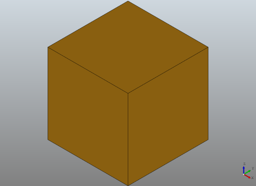

# OCC Wrapper Library

[](https://AutodeskAILab.github.io/occwl)

OCCWL is a simple, lightweight Pythonic wrapper around pythonocc (python bindings for OpenCascade).

## Installing our conda package

```
conda create --name=myoccwlenv python=3.7
source activate myoccwlenv
conda install -c lambouj -c conda-forge occwl
```

We have noticed `conda` running very slow recently.  See issue #26.  If `conda` is too slow, we recommend using `mamba`.
```
conda install -n base mamba -c conda-forge
...
mamba install occwl -c lambouj -c conda-forge
```


## Hello world

```python
from occwl.solid import Solid
from occwl.viewer import Viewer

box = Solid.make_box(10, 10, 10)
v = Viewer()
v.display(box)
v.fit()
v.show()
```

should display a box:



More examples are available in the `examples` folder.


## Developing and maintaining OCCWL

Please see [here](docs/occwl_developers_guide.md) for information useful for developers and maintainers of OCCWL.  This includes details on how to run tests and publish the conda package.


## Maintainers

- Pradeep Kumar Jayaraman (pradeep.kumar.jayaraman@autodesk.com)
- Joseph Lambourne (joseph.lambourne@autodesk.com)
